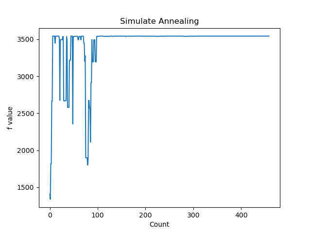
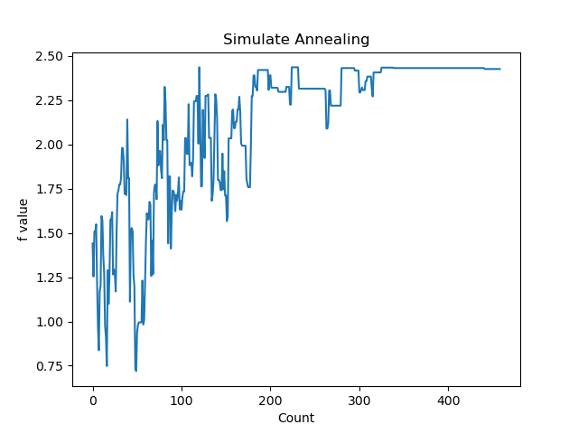

# CIM-Tuner (DATE '26) 
-- * Balancing the Compute and Storage Capacity of SRAM-CIM Accelerator via Hardware-mapping Co-exploration *

## Introduction

CIM-Tuner is a hardware-mapping co-exploration framework designed to balance the compute and storage capacity of SRAM-based Compute-in-Memory (CIM) accelerators. It provides a comprehensive simulation and optimization environment for exploring CIM accelerator architectures and their mapping strategies to deep neural networks.

### Project Structure

- **cim_config**: Configuration files for CIM simulation, implementing the Matrix Abstraction for generalized CIM Macro modeling.
- **evacim**: Core simulator scripts, including the CIMMA Compiler, RTL and area/power modeling components.
- **experiments**: Experimental scripts featuring heuristic-pruned simulated annealing algorithms for design space exploration.
- **nn_config**: Neural network configuration files.
- **Result**: Log files and experimental results.
- **plot**: Visualization plots and figures.

---

## 1. CIMMA Compiler Setup

### Compilation Steps
1. Navigate to the compiler directory:
```bash
cd ./evacim/CIMMA_Compiler
```
   
2. Compile the C program:
```bash
make
```

### Testing & Verification
- Run the test script to validate compilation: 
```bash
python3 try.py
```
The expected output is a list of instruction counts for various CIM accelerator operations.

### Instruction Visualization
1. Enable instruction writing in `compiler_count.c`:
```c
#define WRITE_INST 1
```

2. Recompile and run:
```bash
make
python3 try.py
```

Compiled instructions will be saved to `./Result/inst.txt`.

> **Note**: For speed during top-level simulations, disable visualization by setting `WRITE_INST` to `0`.

---

## 2. Simulator and Evaluation Setup

### Basic Operation
Return to the root directory:
```bash
cd ../..
```

Run a single accelerator operation:
```bash
python3 -m evacim.sim \
    --cim ./cim_config/FPCIM@ISSCC23.cfg \
    --para 25.6 2 2 16 128 64 \
    --operator 256 512 256 \
    --dataflow R_WP_PF
```

### Parameter Reference
View all parameter options:
```bash
python3 -m evacim.sim --help
```

### Full Model Evaluation
Run an end-to-end evaluation:
```bash
python3 -m evacim.sw_func \
    --cim ./cim_config/FPCIM@ISSCC23.cfg \
    --paras 25.6 2 2 16 64 64 \
    --model nn_config/bert_base_sl64.csv \
    --target th
```

---

## 3. Hardware-Mapping Co-exploration

### Operator-Level Exploration
```bash
python3 -m experiments.cim_sa_gli
```
This script explores the accelerator architecture of FPCIM@ISSCC23 under fixed operator and dataflow (could be directly modified in ./experiments/cim_sa_gli.py's main function). The optimal target is throughput and area constraint is 5 mm^2. The annealing progress is shown:


### Network-Level Exploration
```bash
python3 -m experiments.cim_sa_model
```
This script explores both the architecture and mapping strategies of FPCIM based accelerator on Bert\_base. The optimal target is energy efficiency and area constraint is 5 mm^2. For other configurations, directly revise the script. The example annealing is shown:


### Additional Experiments
- View all paper experiments in `./experiments`
- Access result visualizations in `./plot`

## If you use this project in your research, please cite our paper:
```
J. Chen, et al. "CIM-Tuner: Balancing the Compute and Storage Capacity of SRAM-CIM Accelerator via Hardware-mapping Co-exploration" 2026 Design, Automation & Test in Europe Conference (DATE). IEEE, 2026.
```